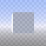

<header>
    <h1>Windsurfen-Ecke von Stagirit</h1>
</header>

    

        <h2>Über den Kanal</h2>
    

    

        Windsurfen ist besser als uralte Computerspiele. Aber Sie können doch nie die Lösung selber finden. 
    




    

        <h2>Kontakt</h2>
    

    
    <ul>
        <li class="p-name fn">
            Maciej Matiaszowski
        </li>
{% include url.html header="Email" url="mailto:maciej.matiaszowski@gmail.com?subject=Windsurfen-Ecke%20von%20Stagirit" title="Email me" name="stagyrite@int.pl" text="📧"%}



    </ul>

<footer>stdin | stdout</footer>
